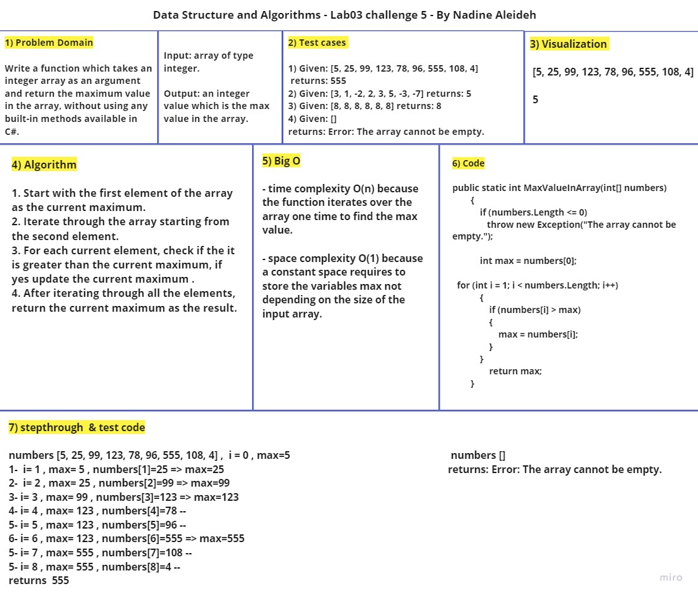
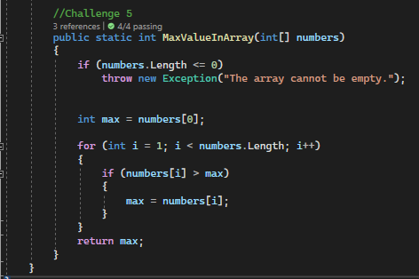
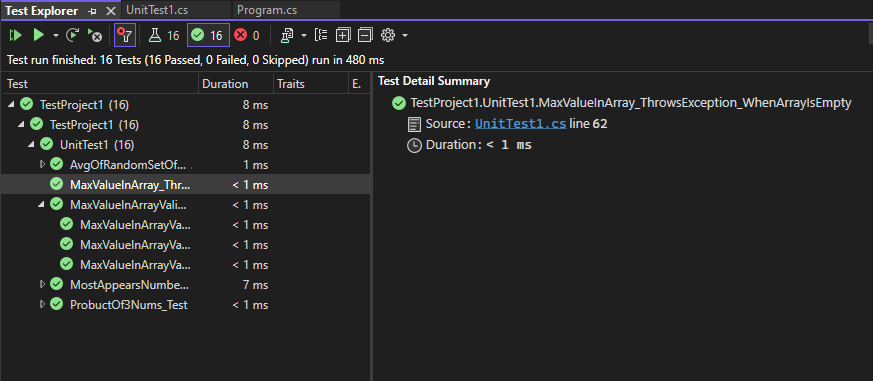
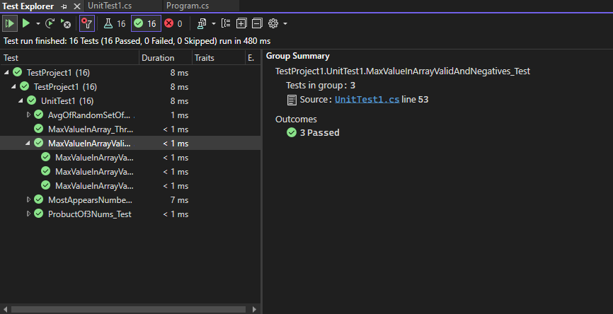

# Lab3 Challenge 5 : Find Max Value In Array 

Writing a function which takes an integer array as an argument and return the maximum value in the array, without using any built-in methods available in C#. 

## Whiteboard Process For Challenge 5

## Approach & Efficiency

1. Start with the first element of the array as the current maximum.
2. Iterate through the array starting from the second element.
3. For each current element, check if the it is greater than the current maximum, if yes update the current maximum .
4. After iterating through all the elements, return the current maximum as the result.

- time complexity O(n) because the function iterates over the array one time to find the max value.

- space complexity O(1) because a constant space requires to store the variables max not depending on the size of the input array.

## Solution 

### How to run 

After writing the code, In the Main class do the following:

  1. Initialize numbers as shown.
  2. Call MaxValueInArray(numbers) within the Initialize maxvalue as shown.

### Unit Testing 

